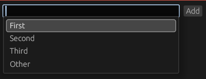

# egui-dropdown
Dropdown list for egui.



# Installation
```toml
[dependencies]
egui-dropdown = "0.11"
```

# Usage
```rust
// Working example can be found in `examples/dropdown.rs`

ui.add(DropDownBox::from_iter(
    &self.items,
    "test_dropbox",
    &mut self.buf,
    |ui, text| ui.selectable_label(false, text)
));
```

# Naming
Although it's called `DropDownBox`, technically speaking it should be called `ComboBox`.
But this is what egui uses for its version of the widget so yeah.
